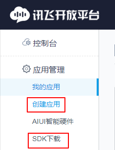
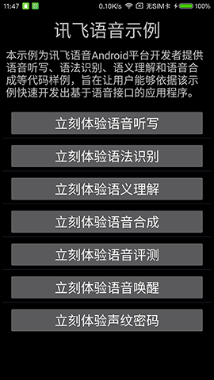

## 讯飞的sdk下载以及关联
登录讯飞开放平台, 在左侧栏中有sdk下载, 并且还有创建应用

把sdk和我们的程序进行关联,仅仅需要一个appid, 不需要包名什么的等其他东西. 所有有时你在开放平台上创建了一个应用,可以把这个appid给多个app使用,但是讯飞官方不推荐这样使用

## app module
这个module是开发京东方智能后视镜时, 有关语音识别部分的代码. 通过AIDL跨进程进行识别, 供所有程序使用
然后进行了拓展, 包括 SpeechUnderstand(语义识别), Asr(语法识别), Iat(语音听写), Tts(语音合成,有两种形式:一种强制打断型, 一种是导航播报的队列模式)

SpeechUnderstanderService, AsrService, IatService 这三个Service的使用流程: 当客户端启动后, 先注册Callback到服务端, 然后当客户端调用startUnderstanding() 开始识别时, 也把客户端中的Callback传了进去.

可以发现: 上述的这个过程中的 注册 Callback 过程可以删掉, 仅在调用 startUnderstanding() 传入Callback即可, 因为这个过程我当时一开始想使用类似观察者模式的形式. 一旦服务端的识别服务识别到结果,就通知所有注册的观察者(客户端).
但是后来又换成了另外一种方式: 在调用 startUnderstanding() 时传入Callback参数,然后根据优先级判断 当前一次的识别还未结束时, 后面发起的识别应不应该强制中断前一次的识别过程.
而代码中之所以还没有把注册的过程给删掉, 是为了方便以后根据业务需求便于更改.

## speechdemo module
这个 module 是讯飞官方提供的Demo.

这里面专门有一个用于测试 app module 中的各种Service的类 MainTestActivity
剩余的东西就都是讯飞官方提供的Demo.

